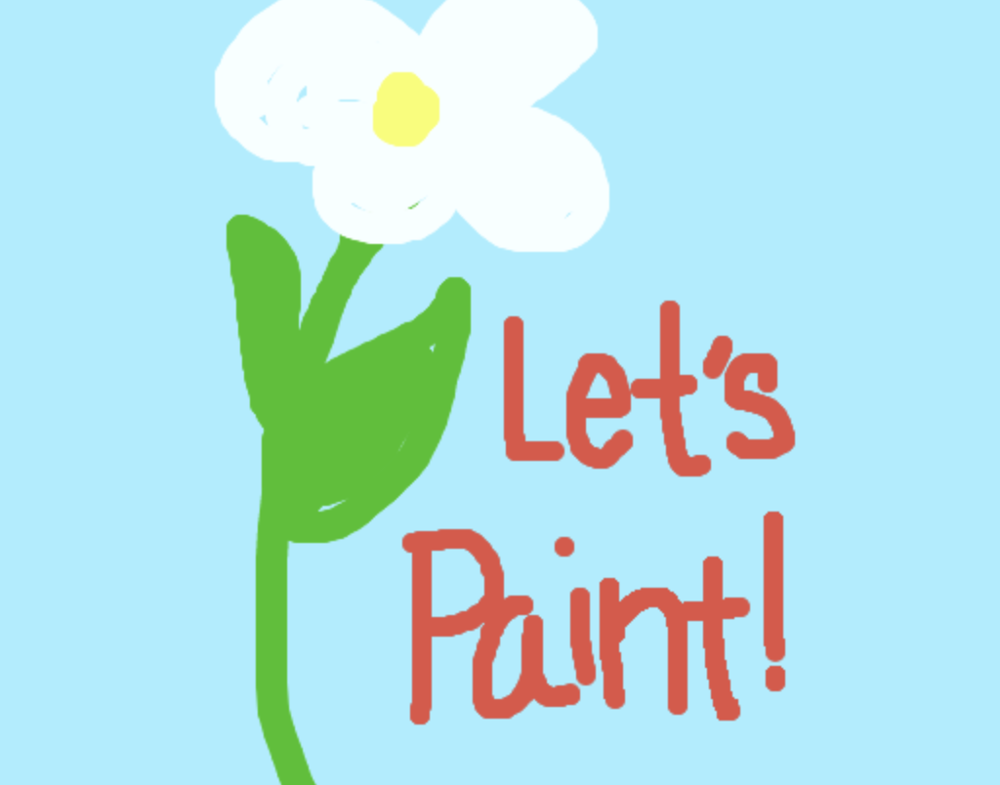

## 🎨 Paint-Clone 👩‍🎨 - In Progress!

## Overview
An application with a Canvas HTML element to create a basic version of MS Paint

Inspired by Udemy JS Web Projects: 20 Projects to Build Your Portfolio, but with additional customizations:
- favicon logo
- CSS

## Technologies 
- JavaScript
- HTML5
- CSS3

## User Stories
A user can do all of the following: 
- Select mutliple colors
- Select canvas color
- Use slider to change the size of the paint brush
- Draw on the canvas
- Use the eraser to edit image
- Save on local storage
- Save image as a jpeg with icon 
- App is mobile responsive, so users can access app on either phone, tablet or computer

## Resources
- [Icons](https://icon-icons.com/)
- [Google Fonts](https://fonts.google.com/)
- [JS Color](https://jscolor.com/)
- [Slider](https://www.w3schools.com/howto/howto_js_rangeslider.asp)
- [API Rednering](https://developer.mozilla.org/en-US/docs/Web/API/CanvasRenderingContext2D)
- [Snackbar](https://www.geeksforgeeks.org/how-to-create-a-snackbar-using-hmtl-css-javascript/) 
- [Canvas](https://developer.mozilla.org/en-US/docs/Web/API/Canvas_API/Tutorial) 
