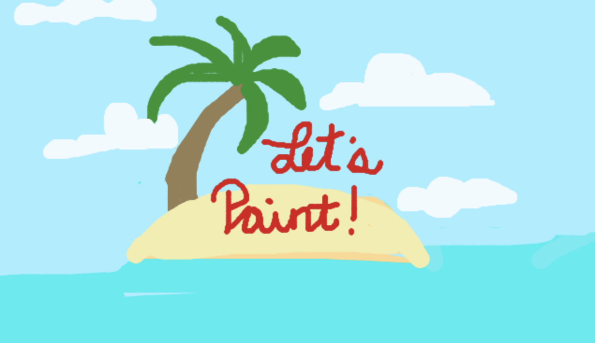

## 🎨 Paint-Clone 👩‍🎨 

## Overview
An application with a Canvas HTML element to create a basic version of MS Paint

Inspired by Udemy JS Web Projects: 20 Projects to Build Your Portfolio, but with additional customizations:
- favicon logo
- CSS3/HTML5
- Icons 

## Technologies 
- JavaScript
- HTML5
- CSS3

## Tools
   - Brush:  Tools to draw on canvas.
   - Bucket: Change canvas background color.
   - Eraser: Earse partial drawn element.
   - Slider: Size of Brush or Eraser.
   - Color Picker: Pick a color.
   - Clear canvas: Clear everything from canvas.
   - Save Local Storage: Save current canvas to browser local storage.
   - Load local storage: Load currently saved canvas from browser local storage.
   - Delete local storage: Delete the currently saved canvas from the browser local storage.
   - Undo: Partially go backwards.
   - Redo: Partially go forward.
   - Save: Save to local drive.

## Resources
- [Icons](https://icon-icons.com/)
- [Google Fonts](https://fonts.google.com/)
- [JS Color](https://jscolor.com/)
- [Slider](https://www.w3schools.com/howto/howto_js_rangeslider.asp)
- [API Rednering](https://developer.mozilla.org/en-US/docs/Web/API/CanvasRenderingContext2D)
- [Snackbar](https://www.geeksforgeeks.org/how-to-create-a-snackbar-using-hmtl-css-javascript/) 
- [Canvas](https://developer.mozilla.org/en-US/docs/Web/API/Canvas_API/Tutorial) 
- Project Inspired by: [javascript20-projects](https://github.com/zero-to-mastery/javascript20-projects)

